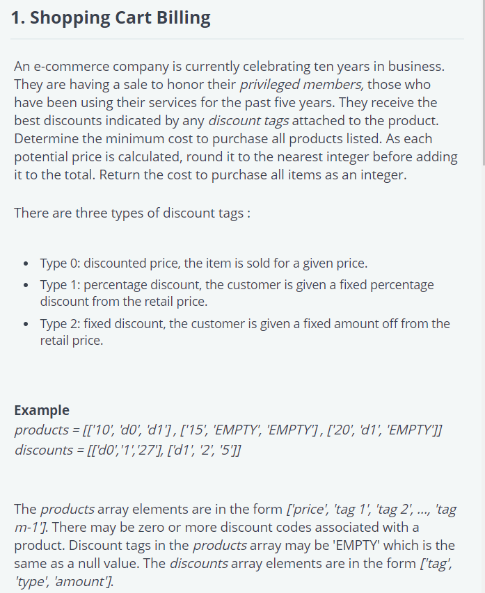

# Coupon Checkout

::: tip Where the OA comes from?
The OA problems are from Internet, mostly from leetcode discussions. They are free and available everywhere, so don't trust anyone ask money to access these OA,
:::

An Amazon seller is celebrating ten years in business! They are having a sale to honor their privileged members, those who have purchased from them in the past five years. These members receive the best discount indicated by any discount tags attached to the product. Determine the minimum cost to purchase all products listed. As each potential price is calculated, round it to the nearest integer before adding it to the total. Return the cost to purchase all items as an integer.

    There are three types of discount tags:

> * Type 0: discounted price, the item is sold for a given price.
> * Type 1: percentage discount, the customer is given is fixed percentage discount from the retail price.
> * Type 2: fixed discount, the customer is given a fixed amount off from the retail price.
    
## Input
* products: an **[n][m]** 2D array of product descriptors as strings: price followed by m-1 discount tags
* discounts: an **[d][3]** 2D array of tag descriptors as strings: tag, type, amount
## Output
* the total amount paid for all listed products, discounted to privileged members' pricing

## Examples
Example 1:
Input:

* products = [['10', 'do', 'd1'], ['15', 'EMPTY', 'EMPTY'], ['20', 'd1', 'EMPTY']]
* discounts = [['d0','1','27'], ['d1', '2', '5']]

Output:

* 35

## Explanation:

The total price to purchase the three items is 5+15+15=35.

## Constraints
1 <= n, m, d <= 1000